@lab.Title

Login to your VM with the following credentials...

**Username: ++@lab.VirtualMachine(Win11-Pro-Base-VM).Username++**

**Password: +++@lab.VirtualMachine(Win11-Pro-Base-VM).Password+++** 

---

*Welcome to your lab environment. Write your lab content here.*

# Introduction to Fluid Framework

# Goal for this lab

Building a modern real time recruitment pipeline management app with features that include:
- SharePoint Embedded as backend
- AI Collaboration
- Multi User presence

## Setup SharePoint Embedded Backend


The first step to setup the Sharepoint Embedded Container for powering the data store for realtime collaboration is through the Sharepoint Embedded VS Code extension.

1. Setup VS Code Extension

	Open Visual Studio Code on your lab machine where the Sharepoint Embedded extension is installed. Refer the image below to open the extension and then use the credentials below to sign into your M365 tenant. The admin credentials are provided below:

	Username:
	++@lab.CloudCredential(IgniteLAB440-CredentialPool).AdministrativeUsername++

	Password:
	+++@lab.CloudCredential(IgniteLAB440-CredentialPool).AdministrativePassword+++

	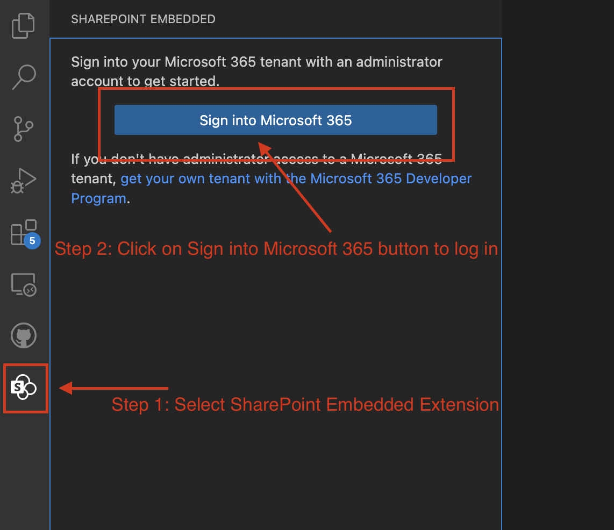

1. Allow VS Code Extension to manage your resources

	Once signed in, give VS Code extension the permissions to create resources on your behalf. See the image below for reference.

	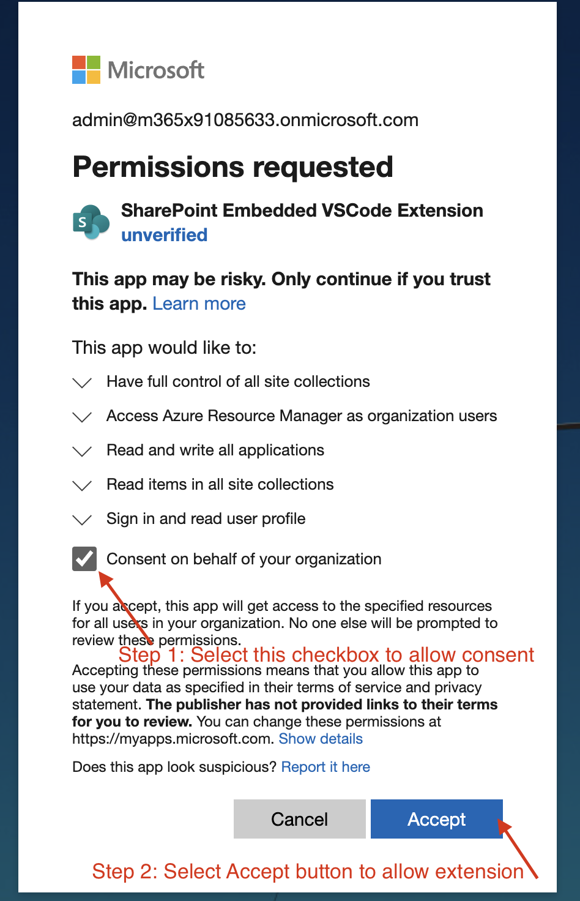

1. Complete the sign in process

	Follow the prompts and allow the sign in process to complete. Some pop-ups that would come to allow sign in redirects (see image below for reference)

	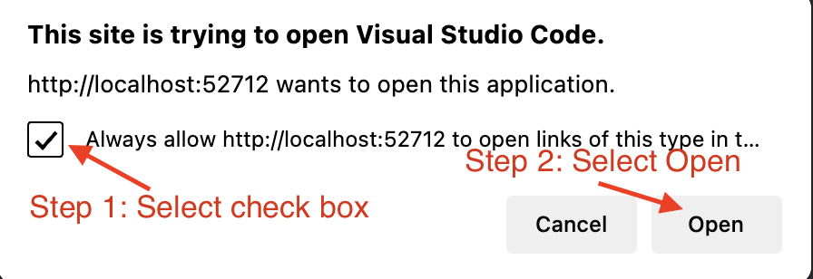
	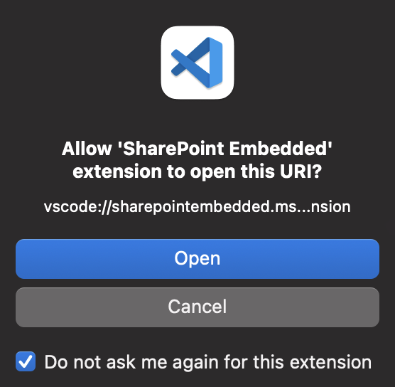

1. Create Container Type

	Next, we will create a container type which is of type trial container that allows creation of temporary development resources. See the image below for reference.

	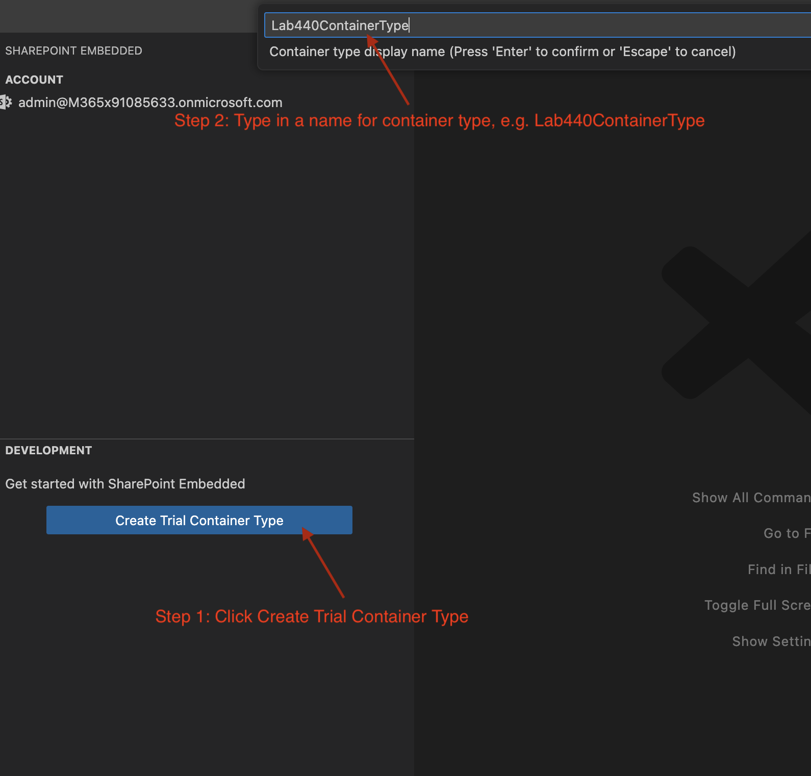

1. Configure Owning App for Container Type

	Next, it will give you a prompt to select the owning app for this new container type. We will create a new Sharepoint Embedded App which will own this new container type. See the image below for reference.

	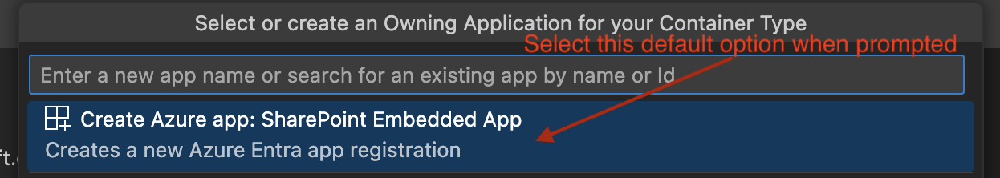

	Recap of what we have done so far: 
	## TODO: Add recap here.

1. Recap and verification

	This is what the SharePoint Embedded VS Code Extension should show at this point:

	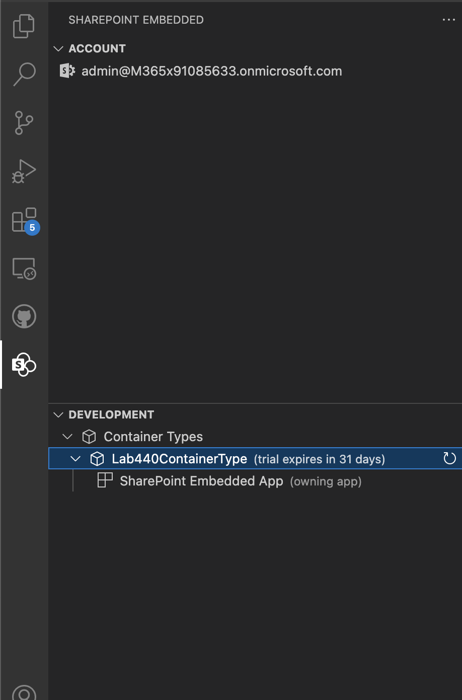

1. Add required permissions for the app
	Next we will add the permissions required for our new SharePoint Embedded App to access container and also add permissions that will be required by the app. To do that, we will open the Azure Portal and search - select `App Registrations` from the Search Bar. See image below for reference.

	Azure portal link: @lab.CloudPortal.Link

	> Note: You do not need any new login for this Azure Portal. The M365 credentials which you used to login should be automatically picked for this Azure portal.

	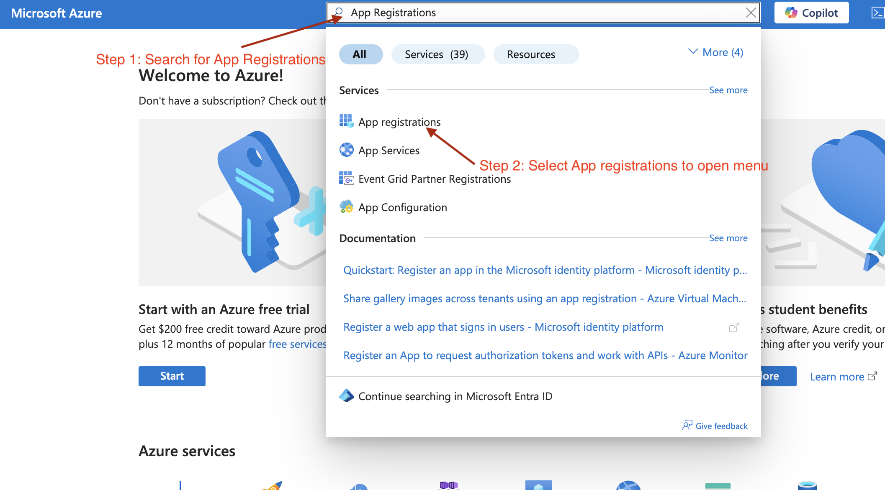

	Once you open the `App Registrations` pane, select "All applications" pane and then select "SharePoint Embedded App." Please see image below for reference.

	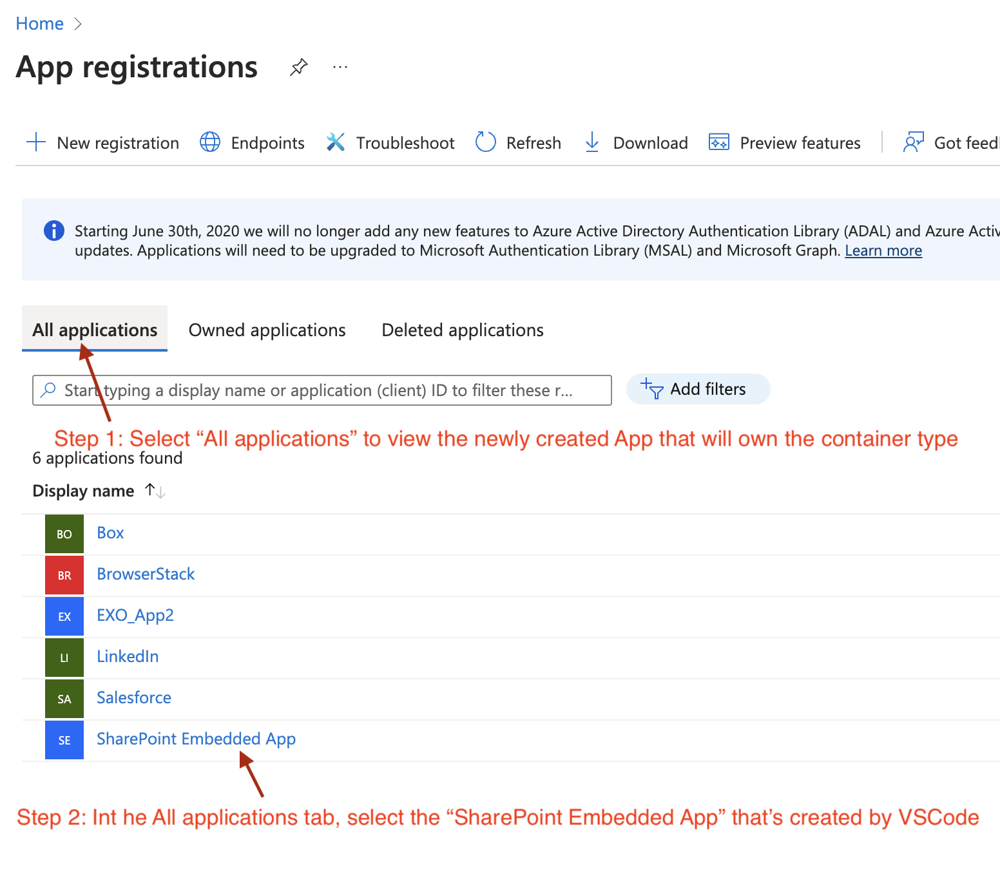

	In the new App registration page for SharePoint Embedded, select he Manifest option from the left pane as shown in image below. 

	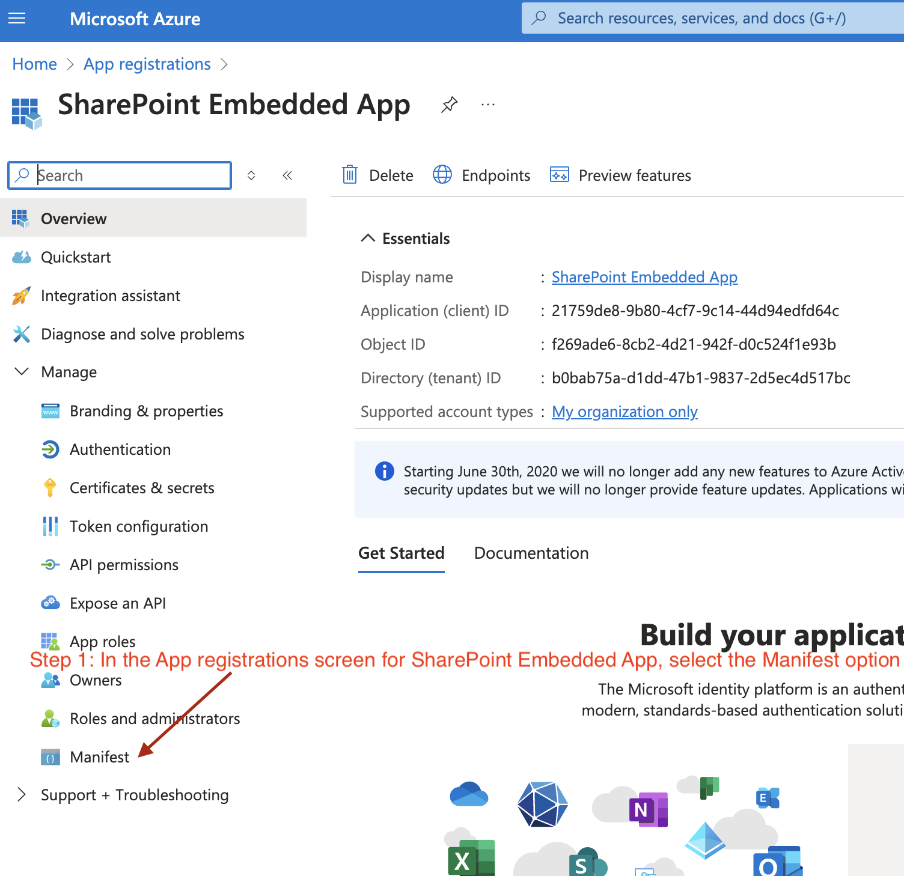

	On the Manifests page, we will udpate the permissions that the new app requires to function correctly. To do that we will locate the "requiredResourceAccess" section and replace it with the permissions listed below the reference image.

	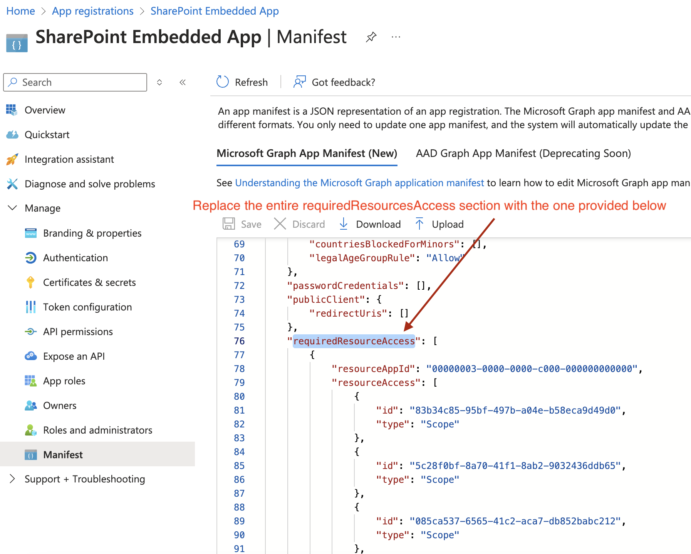

	```
	"requiredResourceAccess": [
			{
				"resourceAppId": "4747d38e-36c5-4bc3-979b-b0ef74df54d1",
				"resourceAccess": [
					{
						"id": "898f9f5d-bf7c-4bf5-97ed-39cda772c50a",
						"type": "Scope"
					}
				]
			},
			{
				"resourceAppId": "00000003-0000-0000-c000-000000000000",
				"resourceAccess": [
					{
						"id": "83b34c85-95bf-497b-a04e-b58eca9d49d0",
						"type": "Scope"
					},
					{
						"id": "5c28f0bf-8a70-41f1-8ab2-9032436ddb65",
						"type": "Scope"
					},
					{
						"id": "085ca537-6565-41c2-aca7-db852babc212",
						"type": "Scope"
					},
					{
						"id": "7427e0e9-2fba-42fe-b0c0-848c9e6a8182",
						"type": "Scope"
					},
					{
						"id": "37f7f235-527c-4136-accd-4a02d197296e",
						"type": "Scope"
					},
					{
						"id": "14dad69e-099b-42c9-810b-d002981feec1",
						"type": "Scope"
					},
					{
						"id": "89fe6a52-be36-487e-b7d8-d061c450a026",
						"type": "Scope"
					},
					{
						"id": "40dc41bc-0f7e-42ff-89bd-d9516947e474",
						"type": "Role"
					}
				]
			},
			{
				"resourceAppId": "00000003-0000-0ff1-ce00-000000000000",
				"resourceAccess": [
					{
						"id": "19766c1b-905b-43af-8756-06526ab42875",
						"type": "Role"
					}
				]
			}
		],
	```

1. Register Container Type and associated permissions with tenant

	Now that we have specified the permissions required, we will now register this new container type and associated permissiosn with the tenant to allow these new permissions that the consuming app will need. To do that, we will come back to VS Code SharePoint Embedded Extension, select the Container Type that we created, Right Click it and select "Register on local tenant". Please refer to image below.

	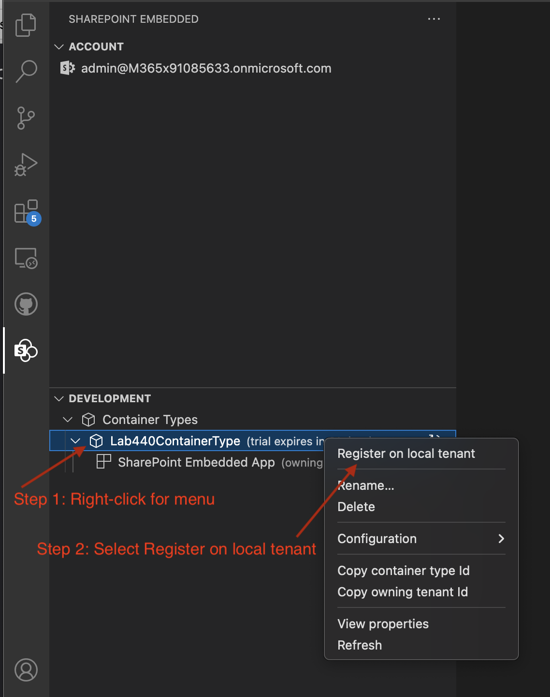

	This will create a pop-up on bottom right side in VS Code. In the pop-up, select the "Open Consent Link" button. This will open a permissions prompt where we view and verify the permissions the App is going to get, and then allow it.

	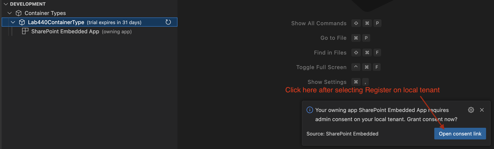

	This will open a page in browser with list of permissions, which we will Accept to proceed further.

	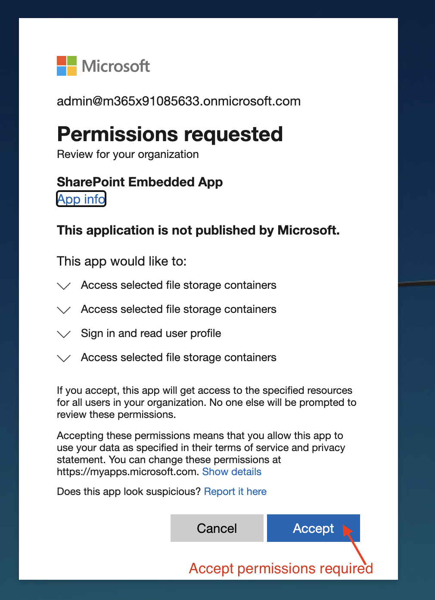

	That's it! Now all the permissions and backend for using SharePoint Embedded is fully setup. 
	
1. Extract required backend configuration for the app

	The last step is to retrieve the configuration for this setup. We can easily fetch that from the VS Code SharePoint Embedded Extension also. In VS Code, Right-click on the Container Type and select "View Properties". See image below for reference.

	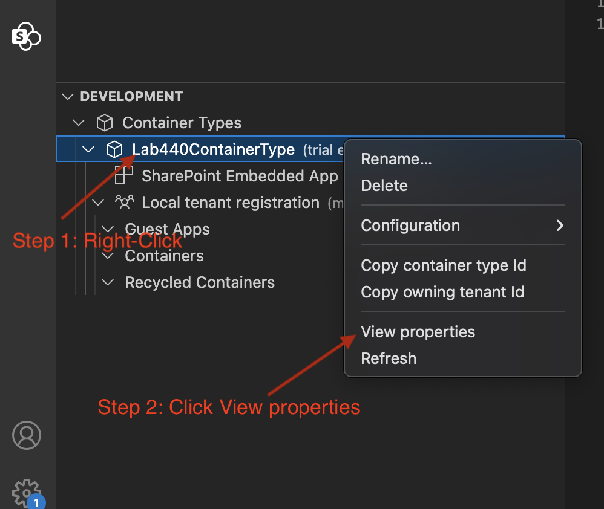

	This will display all the configration properties. The following keys are of our interest which we will copy into the `.env` file of our app.

	```
	"OwningAppId": "1e761d92-986a-xxxx-xxxx-xxxxxxxxxx",
	"ContainerTypeId": "6759b8da-xxxx-xxxx-xxxx-xxxxxxxx",
	"OwningTenantId": "501a7815-xxxx-xxxx-xxxx-xxxxxxxxxx",
	```

## Configuration for Azure OpenAI Endpoint

All lab attendees get their own OpenAI endpoint to play around with varied requests. The resources are created already and here's the configuration to put it in the app's .env file.

OpenAI Endpoint

@lab.CloudResourceTemplate(Lab440AzureOpenAIResourceCreation).Outputs[openAIEndpoint]openai/deployments/gpt4o/chat/completions?api-version=2024-08-01-preview

OpenAI API Key

@lab.CloudResourceTemplate(Lab440AzureOpenAIResourceCreation).Outputs[openAIKey]

Copy below configuration and append it to the `.env` file of the application.

```
AZURE_OPENAI_ENDPOINT='@lab.CloudResourceTemplate(Lab440AzureOpenAIResourceCreation).Outputs[openAIEndpoint]openai/deployments/gpt4o/chat/completions?api-version=2024-08-01-preview'
AZURE_OPENAI_API_KEY='@lab.CloudResourceTemplate(Lab440AzureOpenAIResourceCreation).Outputs[openAIKey]'
```
